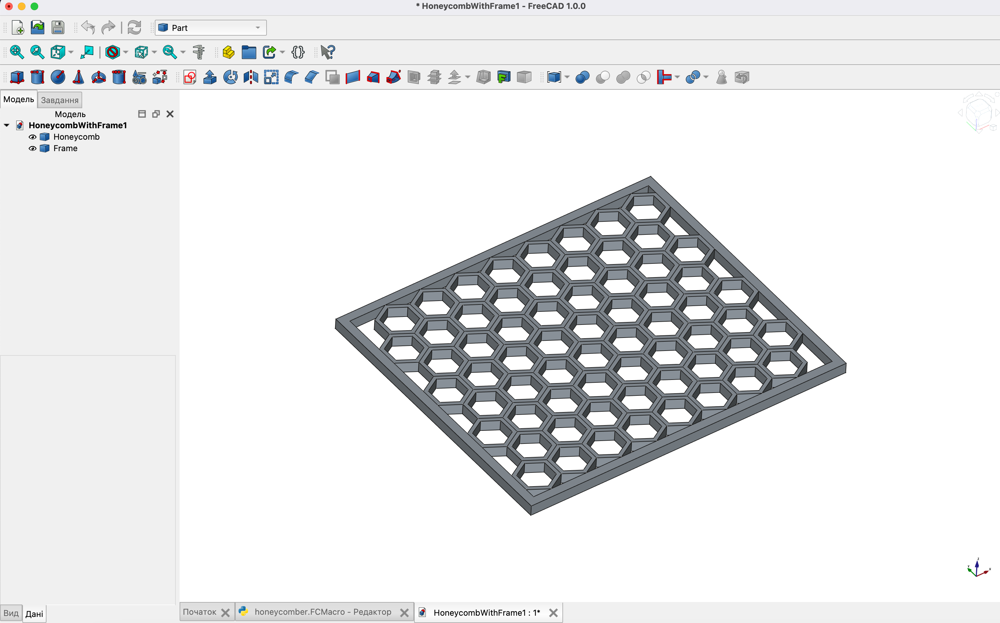

# Honeycomb with Frame in FreeCAD

This project generates a parametric honeycomb structure with an exact-fit frame using FreeCAD and Python.

## Features

- **Parametric Design:** Easily adjust parameters such as cell size, wall thickness, and overall grid dimensions.
- **Modular Code:** Object-oriented design for better maintenance and extensibility.
- **Automatic View Fit:** Adjusts the FreeCAD view automatically when running in GUI mode.

## Usage

1. Open FreeCAD and load this script as a macro.
2. Modify parameters (e.g., grid dimensions, cell size, wall thickness) in the `main()` function if needed.
3. Run the macro to generate the honeycomb structure and the enclosing frame.
4. The generated model will be displayed in the FreeCAD GUI.

## Requirements

- FreeCAD (tested with v1.0.0)
- Python 3.x

## License

This project is licensed under the MIT License.
